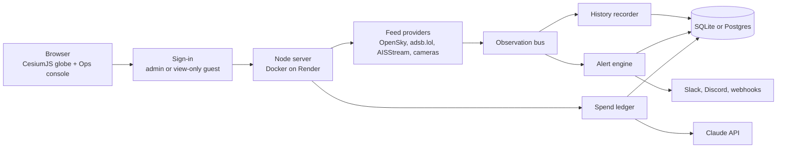

# Track Overhead

A hosted, access-controlled build of God's Eye View with track history, replay, alerting and camera-coverage analytics added on top.

> **Built on [God's Eye View](https://github.com/bilawalsidhu/gods-eye-view)** by Bilawal Sidhu and Sameh Khamis (MIT). The 3D globe, live data layers, cockpit view, sensor styles and the original voice agent are theirs. This page covers what I added. The original project's README is [here](../README.md).

**Live:** [trackoverhead.com](https://trackoverhead.com) (sign-in required; message me for a guest login)

<!-- Hero GIF and walkthrough video go here once recorded. -->

## Why

God's Eye View runs on your own machine and binds to localhost on purpose, because a shared instance would hand your API keys to anyone who can reach it. I wanted a version I could share with friends and family safely, and I wanted it to remember what it saw: where traffic went, not just where it is.

## What I added

About 9,500 lines, almost all in 51 new files. About 80 lines of upstream source changed, mostly small hooks, so syncing with upstream stays easy. 64 tests in 9 files cover the new code.

| Feature | What it does | Where |
| --- | --- | --- |
| Track history | Records aircraft and vessel fixes from the live feeds, thins them sensibly, applies retention, exports GeoJSON, CSV or KML | [9f05bc0](https://github.com/jasontso2939/gods-eye/commit/9f05bc0) |
| Alerts | Watchlists, fences drawn on the globe, and rules: enters, leaves or loiters in a fence, emergency squawk, goes dark, reappears, speed or altitude out of band, circling, satellite rising overhead. Delivered live and to Slack, Discord or webhooks | [7b2dd94](https://github.com/jasontso2939/gods-eye/commit/7b2dd94) |
| Camera coverage | Which ground each public camera can see (seen by 0, 1, 2, 3+) and 7-day uptime per camera. Geometric only: no frames decoded or stored | [b730bf9](https://github.com/jasontso2939/gods-eye/commit/b730bf9) |
| Ops console | One panel for alerts, watch rules, replay at 1x to 900x, history search and camera coverage | [96e0e06](https://github.com/jasontso2939/gods-eye/commit/96e0e06) |
| Hosted profile | Production server with sign-in (tokens or Supabase), per-user data and quotas, SQLite or Postgres, Docker, Render and Fly configs | [5f31165](https://github.com/jasontso2939/gods-eye/commit/5f31165), [6a0a83a](https://github.com/jasontso2939/gods-eye/commit/6a0a83a) |
| Claude voice control | Speech in the browser, Claude on the server with map actions as tools, and a spend ledger that refuses any call that could cross the daily or monthly cap | [PR #4](https://github.com/jasontso2939/gods-eye/pull/4) |
| Guest logins | View-only access: no voice spend, no saved rules, revoked for everyone by changing one variable | [PR #5](https://github.com/jasontso2939/gods-eye/pull/5) |
| View angles | Four pitch presets plus step tilt and rotate | [PR #2](https://github.com/jasontso2939/gods-eye/pull/2) |

Docs: [docs/TRACKING.md](../docs/TRACKING.md) and [docs/HOSTED.md](../docs/HOSTED.md).

## How it works

The existing flight and ship providers publish what they already receive to an in-process bus, with a one-line hook each. The recorder and the per-user alert engines subscribe to it, so nothing new polls the upstream APIs. If the store or any new service fails, the globe and live layers keep working.

## Decisions and tradeoffs

- **Two layers of spend control.** Before every Claude call the server reserves the worst-case cost and refuses the call if it could cross the cap ($1 a day, $5 a month by default). The Anthropic workspace limit and prepaid credit with auto-reload off sit behind it, because the ledger resets on Render's free plan when the service restarts.
- **Guests get the map, not the wallet.** Voice and anything that writes to the server are off for guests, so sharing the site can't run up a bill or change anything.
- **Additive, not invasive.** New work lives in new folders and touches upstream only at hook points. Upstream ships almost daily, and this keeps rebasing cheap.
- **The only browser-visible key is domain-restricted.** Every other key stays on the server. I skipped a Google Maps key because the cost and risk outweighed the benefit for a family audience.
- **A privacy line, held on purpose.** It tracks aircraft, ships, satellites and infrastructure. No face recognition, plate reading, re-identifying people across cameras, stored camera frames, or unmasking aircraft the feeds hide.

## Bugs worth telling

- **Ships disappeared in production.** Live ship tracking worked locally and silently failed on Render. The `ws` package was a dev dependency, so the production Docker image didn't include it. ([PR #3](https://github.com/jasontso2939/gods-eye/pull/3))
- **The app rejected its own saves.** The hosted server only accepted writes carrying a matching `Origin` header, and some browsers leave it off same-origin requests. It now also accepts `Sec-Fetch-Site: same-origin` or a matching `Referer`. ([PR #1](https://github.com/jasontso2939/gods-eye/pull/1))

## What I'd do next

- Add Postgres in production so history, alert rules and the spend tally survive restarts.
- Keep the recorder running around the clock on a paid instance.

## How it was built

Built with Claude Code. I chose the features and the privacy scope, made the hosting and security decisions, verified everything on the live site, and directed and reviewed the implementation.

## Run it

Local: `npm ci && npm run dev`, then open http://localhost:4173. Hosted: see [docs/HOSTED.md](../docs/HOSTED.md). Check each data source's terms before inviting anyone ([DATA_SOURCES.md](../DATA_SOURCES.md)).
